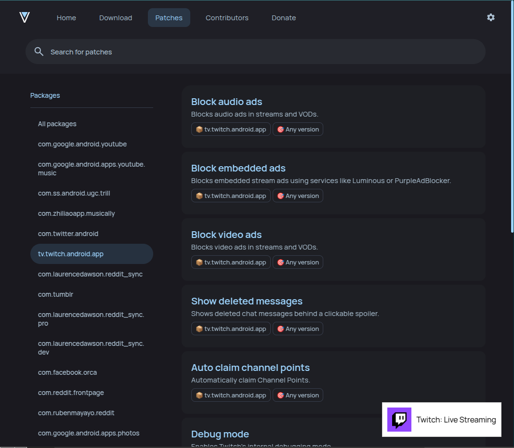

# Fetch App Details from Package Name on Revanced - Userscript

This **Tampermonkey userscript** automatically fetches the **app name** and **icon** from the Google Play Store using the package name extracted from the URL on the **Revanced Patches** website (`https://revanced.app/patches`). It also dynamically updates the app details when the URL changes without a page reload.

---

## **Features**

1. **Automatic Package Name Extraction:**

   - Extracts the `pkg` parameter from the URL (e.g., `com.andrewshu.android.reddit` from `https://revanced.app/patches?pkg=com.andrewshu.android.reddit`).

2. **Fetch App Details:**

   - Fetches the app name and icon from the Google Play Store using the extracted package name.

3. **Dynamic URL Change Detection:**

   - Watches for URL changes (even without a page reload) and updates the app details accordingly.

4. **User-Friendly UI:**
   - Displays the app name and icon in a small, fixed UI container at the bottom-right corner of the page.

---

## **UI Preview**

The app name and icon are displayed in a small container at the bottom-right corner of the page:

```
---------------------------------
| [App Icon]  YouTube           |
---------------------------------
```



---

## **How It Works**

1. **Extract Package Name:**

   - The script extracts the `pkg` parameter from the current URL.

2. **Fetch Data from Google Play Store:**

   - It sends a request to the Google Play Store page for the extracted package name and scrapes the app name and icon URL.

3. **Display Results:**

   - The app name and icon are displayed in a small UI container.

4. **Watch for URL Changes:**
   - The script uses a `MutationObserver` to detect URL changes and updates the app details dynamically.

---

## **Installation**

1. Install the **Tampermonkey** browser extension:

   - [Tampermonkey for Chrome](https://chrome.google.com/webstore/detail/tampermonkey/dhdgffkkebhmkfjojejmpbldmpobfkfo)
   - [Tampermonkey for Firefox](https://addons.mozilla.org/en-US/firefox/addon/tampermonkey/)
   - [Tampermonkey for Edge](https://microsoftedge.microsoft.com/addons/detail/tampermonkey/dhdgffkkebhmkfjojejmpbldmpobfkfo)

2. Create a new userscript:

   - Open the Tampermonkey dashboard.
   - Click on **Create a new script**.

3. Paste the script code:

   - Replace the default code with the [script provided above](#script-code).

4. Save the script:

   - Click **File > Save** or press `Ctrl + S`.

5. Navigate to the Revanced Patches website:

   - Visit `https://revanced.app/patches?pkg=<package_name>` (e.g., `https://revanced.app/patches?pkg=com.andrewshu.android.reddit`).

6. Enjoy!
   - The script will automatically fetch and display the app name and icon.

---

## **Usage**

1. Open the Revanced Patches website with a `pkg` parameter in the URL (e.g., `https://revanced.app/patches?pkg=com.google.android.youtube`).
2. The script will automatically:
   - Extract the package name from the URL.
   - Fetch the app name and icon from the Google Play Store.
   - Display the results in a small UI container at the bottom-right corner of the page.
3. If the `pkg` parameter changes dynamically (without a page reload), the script will detect the change and update the app details.

---

## **Example**

### Initial URL:

```
https://revanced.app/patches?pkg=com.andrewshu.android.reddit
```

- Fetches and displays details for **Reddit**.

### URL Changes to:

```
https://revanced.app/patches?pkg=com.google.android.youtube
```

- The script detects the change and fetches details for **YouTube**.

---

## **Limitations**

1. **Geographical Restriction**

   - Some application may be restricted in certain areas like `tiktok` is banned in India.

2. **Google Play Store Restrictions:**

   - Google may block requests if made too frequently. Use the script sparingly.

3. **Scraping Reliability:**

   - If Google changes the Play Store HTML structure, the script may break and need updates.

4. **MutationObserver Overhead:**
   - Watching for DOM changes can be resource-intensive if the page updates frequently.

---

## **Contributing**

If you encounter any issues or have suggestions for improvement, feel free to:

- Open an issue on [GitHub](https://github.com/ManabBala/fetch-app-details-on-revanced/issues).
- Submit a pull request with your changes.

---

## **License**

This project is licensed under the MIT License. See the [LICENSE](LICENSE) file for details.
